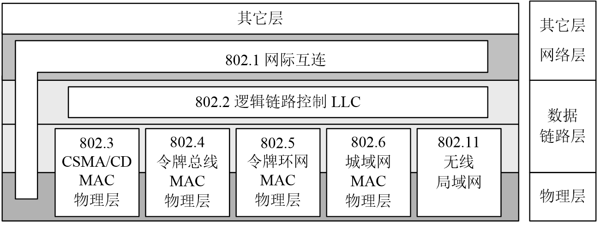

## 计算机网络的定义

 + **强调信息传输**  以计算机之间*传输信息*为主要目的而连接起来以*实现远程信息处理*和进一步*实现资源共享*的计算机系统、
 + **强调共享资源**  以共享资源为主要目的把具有独立功能的计算机连接起来的计算机系统的集合
 + **强调用户透明性**  计算机网络就是一个巨大的计算机系统，用户不会察觉多个计算机系统的存在，不用熟悉资源的分布情况就可以调用计算机各系统的资源。

凡是将分布在不同地理位置上的具有独立工作能力的计算机、终端及其附属设备，用通信设备和通信线路连接起来，并配置网路软件和通信歇息，以实现数据传输和资源共享的系统叫做计算机网络。

## 现代计算机网络的基本特征

现代计算机网络最基本的特征包括：

  + **主机** ( Computer/Host )
  + **通信子网** ( Connected with media )
  + **通信协议** ( Communication protocal and Share information )

   

  早期网络&nbsp;&nbsp;&nbsp;&nbsp;&nbsp;&nbsp;&nbsp;&nbsp;&nbsp;&nbsp;&nbsp;&nbsp;&nbsp;&nbsp;&nbsp;&nbsp;&nbsp;&nbsp;&nbsp;&nbsp;&nbsp;&nbsp;&nbsp;&nbsp;&nbsp;&nbsp;&nbsp;&nbsp;&nbsp;&nbsp;&nbsp;&nbsp;&nbsp;&nbsp;&nbsp;&nbsp;&nbsp;&nbsp;&nbsp;&nbsp;&nbsp;&nbsp;&nbsp;&nbsp;&nbsp;&nbsp;&nbsp;&nbsp;&nbsp;&nbsp;&nbsp;&nbsp;&nbsp;&nbsp;&nbsp;&nbsp;&nbsp;&nbsp;&nbsp;&nbsp;&nbsp;&nbsp;&nbsp;&nbsp;&nbsp;&nbsp;&nbsp;&nbsp;&nbsp;&nbsp;&nbsp;现代网路

## 计算机网络的主要功能

计算机网络的主要功能为：

 + **数据通信**  以文件传输和电子邮件服务为代表的数据通信是计算机网络最基本的功能之一，通过计算机网络可以快速的传递文件和消息，为人们提供一种无纸化办公的环境
 + **资源共享**  指网上用户能够使用全部或部分网络资源，从而大幅度提高各种硬件，软件和数据资源的利用率和使用效果。资源共享包括硬件、软件和数据资源的共享。

除以上两点之外，计算机网络可以实现系统冗余，有效提高计算机系统的可靠性和可用性，同时易于进行分布处理，实现协同式的网络计算

## 计算机网络的分类

  依据  | 分类
--------|-----
传输介质|有线网络、无线网络
经营方式|专用网络、公用网络
服务类型|电信网络、有线电视网络、计算机网络
信道方式|点-点、 广播
地理范围|局域网、广域网、城域网
拓扑结构|总线、星型、环型、树型、网状
资源管理|对等网络、客户/服务器网络

## 网络协议

计算机网络是有多个互联的结点组成的，结点之间要不断地交换数据和控制信息。要做到有条不紊地交换数据，每个结点都必须遵守一些事先约定好的的规则。

将这种**由通信双方共同遵守的通信语义和通信规则的集合**称为网络协议。

从功能角度来讲由以下三要素构成：

 + **语法**：用户数据与控制信息的结构和格式 （什么结构）
 + **语义**：需要发出何种控制信息，以及完成的动作与要做出的响应 （要干什么）
 + **时序**：对事件实现顺序的详细说明和速度匹配

## 网络互联标准

 + **OSI**  开放式系统互联模型
 + **TCP/IP**  传输控制协议/网际互连协议

 

## IEEE802系列标准

 

---------

[更多内容](https://innofang.github.io)
